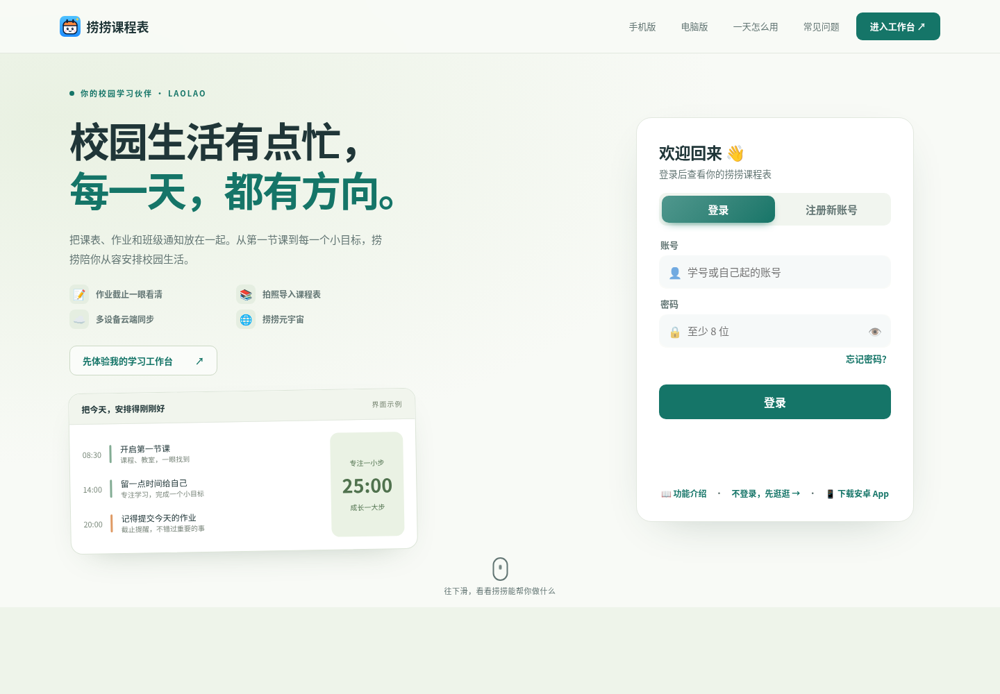
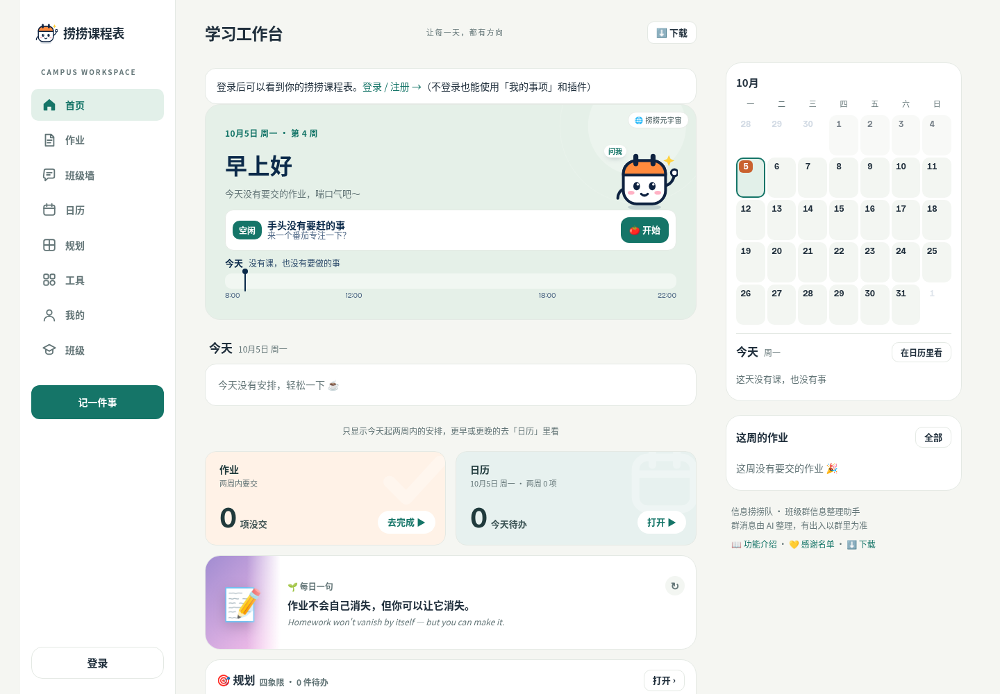
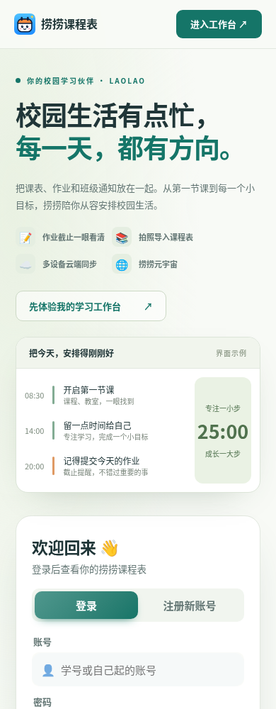
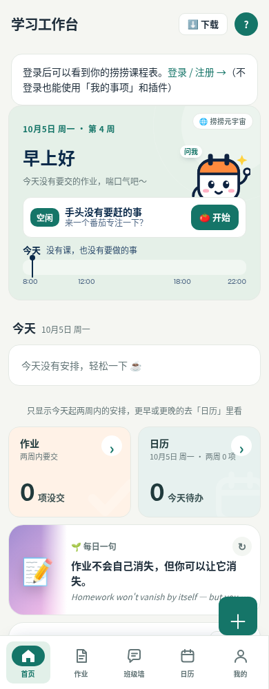

# 校园网站 UI 改版

此次改版继续使用现有静态网页、账号系统和数据接口。默认「清爽」主题统一为暖白、深蓝文字和青绿主色，橙色用于截止提醒；其他可选主题与自定义颜色保留。

- 首次访问页：重新组织校园文案、日程示例、免登录体验入口与登录区；演示内容明确标注为示例。
- 工作台：桌面三栏布局、手机底部导航；今天及近期事项前置，快捷工具与自定义卡片继续沿用原交互。
- 登录、下载、班级管理和开发者页面接入统一视觉层。
- 停用 guard.js 中旧 Competition UI 的动态注入，保留原点击劫持保护。
- 升级 Service Worker 静态缓存并加入新样式，更新引用版本避免旧缓存覆盖新版。

## 截图

### 首次访问页（桌面）

### 学习工作台（桌面）

### 手机页面

## 验证

Chromium / Playwright：6 个页面分别在 360、390、768、1024、1440 像素宽度检查，30 组页面布局均无横向溢出。注册表单切换、找回密码入口、个人事项新增及刷新保存、日历/工具/规划/个人页导航，以及跟随系统暗色主题验证通过；没有 JavaScript pageerror。guard.js、login.js、sw.js 通过 node --check；git diff --check 通过。

测试使用访客的独立浏览器上下文，没有创建真实账号、发送邮件或修改班级数据。真实账号登录、云同步及管理员操作需要在实际账号中验收，不能将入口检查视为后端端到端验证。

## 发布范围

这是网页改版。安卓客户端加载本站页面；Windows 客户端使用 desktop/renderer 中的独立页面，小程序也有独立实现，本次未重做其原生/独立界面。合并到现有网站发布分支后，仍须检查实际域名的页面与缓存更新。
